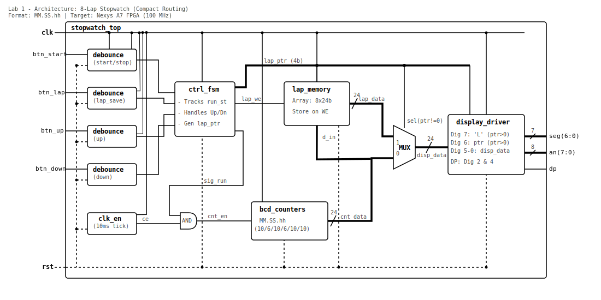

# Projekt: Digitálne stopky 
Tento projekt implementuje digitálne stopky na desku Nexys A7-50T v jazyku VHDL. Stopky merajú čas s presnosťou na stotiny sekundy a umožňujú zmerať čas jednotlivých kôl bez prerušenia merania na pozadí.

# Členovia týmu
- Tomáš Kovařík
- Maroš Kožár
- Áron Kristofori

# Blokové schema

