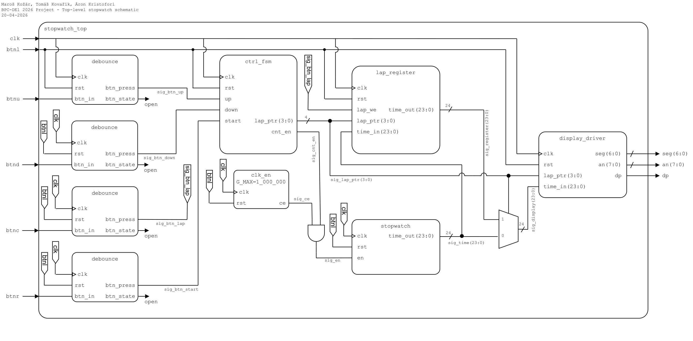
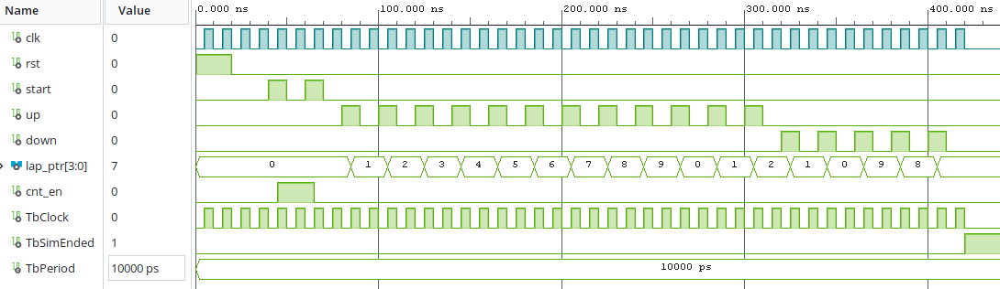

# Group project: Digital stopwatch
This group project will implement a digital stopwatch using VHDL and a Nexys A7-50T FPGA dev board. The stopwatch measures time with accuracy to hundredths of a second with a function to store laps.

# Group members
- Tomáš Kovařík
- Maroš Kožár
- Áron Kristofori

# Top-Level schematic

# Description of components
- [`stopwatch_top.vhd`](./stopwatch/stopwatch.srcs/sources_1/imports/stopwatch.srcs/sources_1/new/stopwatch_top.vhd) (Top-Level): connects together all the components. Receives input from physical buttons and outputs to the seven-segment display. Internal signals route information between the components.
- [`clk_en.vhd`](./stopwatch/stopwatch.srcs/sources_1/imports/stopwatch.srcs/sources_1/imports/new/clk_en.vhd): Divides the main clock frequency of 100MHz to desired value specified during component instantiation.
- [`debounce.vhd`](./stopwatch/stopwatch.srcs/sources_1/imports/stopwatch.srcs/sources_1/imports/debounce.vhd): Filters the mechanical imperfections of a button press, where the contacts rapidly transition between open and closed state, and provides a single impulse on the output.
- [`display_driver.vhd`](./stopwatch/stopwatch.srcs/sources_1/imports/stopwatch.srcs/sources_1/imports/display_driver.vhd): Takes a 24-bit vector with BCD coded representation of the measured time. And a 4-bit lap "pointer" which tells the user which lap is being displayed. The format is `Lx mm:ss.ss`.
- [`ctrl_fsm.vhd`](./stopwatch/stopwatch.srcs/sources_1/imports/stopwatch.srcs/sources_1/new/ctrl_fsm.vhd): It handles starting and stopping the timer itself and navigating the saved laps stored in `lap_register`.
- [`lap_register.vhd`](./stopwatch/stopwatch.srcs/sources_1/imports/new/lap_register.vhd): Upon receiving input from `lap_we` input saves the time from the counter on `time_in` input. Displays the requested time from memory on output `time_out` using `lap_ptr`.

# Simulation
## [`ctrl_fsm`](./stopwatch/stopwatch.srcs/sources_1/imports/stopwatch.srcs/sim_1/new/ctrl_fsm_tb.vhd)

Firstly, we reset all the variables and state of the component by holding the `rst` line HIGH. Then we test out the functionality of `cnt_en` output by sending two button presses to `start` input. The first one turns on the `cnt_en` signalling that the counter should be engaged and the next one disables the output. In the last part of the simulation, we test out the `lap_ptr` output. It outputs a variable instantiated inside the component which is incremented/decremneted by sending button presses to `up`/`down` inputs. It counts from to 0 to 9 and then overflows to the opposite end.

